# Mini-SpringBooty

Framework web ligero en Java puro inspirado en Spring Boot, construido desde cero usando reflexión y anotaciones. Soporta concurrencia mediante un hilo por conexión y apagado elegante (graceful shutdown) mediante un Runtime Shutdown Hook.

---

## Resumen del proyecto

Mini-SpringBooty es un servidor HTTP implementado sobre sockets Java que:

- Escanea el classpath buscando clases anotadas con `@RestController`
- Registra métodos anotados con `@GetMapping` como rutas HTTP GET
- Resuelve parámetros de query string mediante `@RequestParam`
- Sirve archivos estáticos desde `www/webroot/`
- Atiende múltiples conexiones simultáneas (un hilo por conexión)
- Se apaga de forma elegante ante SIGTERM esperando que las conexiones activas terminen antes de cerrar

El servidor escucha en el puerto **35000**.

---

## Arquitectura

```
Cliente (Browser / curl)
        │
        ▼
  MicroSpringBoot          ← Servidor HTTP sobre ServerSocket (puerto 35000)
  (Thread por conexión)    ← new Thread(() -> handleClient(socket)).start()
        │
        ├── Rutas dinámicas   ← Reflexión sobre @RestController / @GetMapping
        │       ├── /app/hello
        │       ├── /app/greeting?name=X
        │       └── /app/promedio?numeros=5,3,4
        │
        └── Archivos estáticos ← www/webroot/index.html
```

**Despliegue:**

```
Desarrollador
    │
    ├─ mvn clean package
    ├─ docker build
    ├─ docker push → DockerHub
    │
    └─ AWS EC2
           └─ docker pull → docker run → puerto 35000
```

### Diagrama de clases

```
MicroSpringBoot
  ├── loadControllers(paquete)   → escanea classpath, registra rutas
  ├── startServer(args)          → ServerSocket + ShutdownHook + Thread loop
  ├── handleClient(socket)       → parsea HTTP, despacha ruta o archivo estático
  ├── processRequest(uri)        → reflexión sobre Method registrado
  └── serveStaticFile(path)      → sirve www/webroot/

@RestController  ←──── GreetingController
@GetMapping      ←──── GreetingController.greeting()
@RequestParam    ←──── greeting(@RequestParam name)

@RestController  ←──── HelloController
@GetMapping      ←──── HelloController.index()
```

| Clase / Archivo | Rol |
|---|---|
| `MicroSpringBoot` | Punto de entrada: escaneo de controladores y arranque del servidor |
| `HttpServer` | Núcleo: server loop concurrente, graceful shutdown, despacho de rutas |
| `@RestController` | Anotación de tipo — marca una clase como controlador HTTP |
| `@GetMapping` | Anotación de método — registra una ruta GET con su path |
| `@RequestParam` | Anotación de parámetro — inyecta query params con valor por defecto |
| `HelloController` | Controlador: `GET /app/hello` |
| `GreetingController` | Controlador: `GET /app/greeting?name=X` (default: `mundo`) |
| `PromedioController` | Controlador: `GET /app/promedio?numeros=5,3,4` (default: `0`) |

### Vista del código — HttpServer

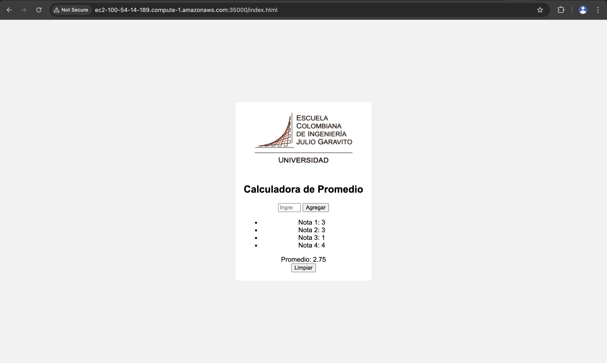

### Vista del código — MicroSpringBoot

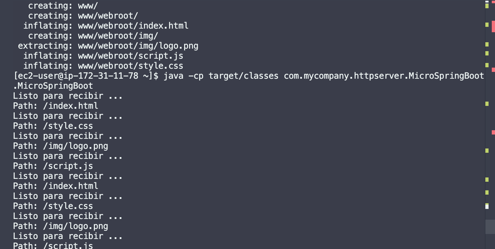

### Vista del código — Controladores

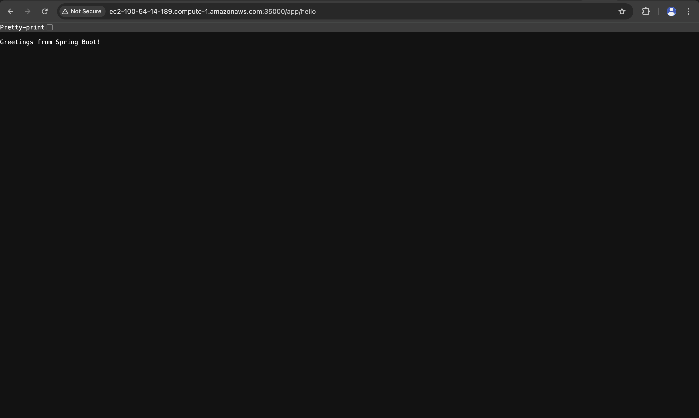


---

## Desarrollo

### Anotaciones

Se implementaron las anotaciones `@RestController`, `@GetMapping` y `@RequestParam`:

```java
@Retention(RetentionPolicy.RUNTIME)
@Target(ElementType.TYPE)
public @interface RestController {}
```

```java
@Retention(RetentionPolicy.RUNTIME)
@Target(ElementType.METHOD)
public @interface GetMapping {
    String value();
}
```

```java
@Retention(RetentionPolicy.RUNTIME)
@Target(ElementType.PARAMETER)
public @interface RequestParam {
    String value();
    String defaultValue() default "";
}
```

### Escaneo automático del classpath

`MicroSpringBoot` escanea el paquete `com.mycompany.httpserver.examples` y registra automáticamente todos los controladores sin configuración manual:

```java
private static void loadControllers(String paquete) throws Exception {
    String ruta = paquete.replace(".", "/");
    ClassLoader loader = Thread.currentThread().getContextClassLoader();
    java.io.File dir = new java.io.File(loader.getResource(ruta).toURI());
    for (java.io.File file : dir.listFiles()) {
        if (file.getName().endsWith(".class")) {
            Class<?> clazz = Class.forName(paquete + "." + file.getName().replace(".class", ""));
            if (clazz.isAnnotationPresent(RestController.class)) {
                for (Method metodo : clazz.getDeclaredMethods()) {
                    if (metodo.isAnnotationPresent(GetMapping.class)) {
                        String rutaMetodo = metodo.getAnnotation(GetMapping.class).value();
                        HttpServer.services.put(rutaMetodo, metodo);
                    }
                }
            }
        }
    }
}
```

### Concurrencia

Cada conexión entrante se despacha en un hilo independiente, permitiendo atender múltiples clientes simultáneamente:

```java
new Thread(() -> handleClient(clientSocket)).start();
```

### Apagado elegante (Graceful Shutdown)

Al recibir SIGTERM (p. ej. `docker stop`), la JVM ejecuta el hook registrado:

```java
Runtime.getRuntime().addShutdownHook(new Thread(() -> {
    running = false;
    serverSocket.close();
    System.out.println("Servidor apagado correctamente.");
}));
```

El flag `running` es `volatile` para garantizar visibilidad entre hilos. Cuando el socket se cierra, el `accept()` lanza `IOException`, el loop detecta `!running` y termina limpiamente.

---

## Requisitos previos

- Java 17+
- Maven 3.6+
- Docker

---

## Instalación y ejecución

### 1. Clonar el repositorio

```bash
git clone https://github.com/buba-0511/microspringboot.git
cd microspringboot
```

### 2. Compilar

```bash
mvn clean install
```

### 3. Correr localmente (sin Docker)

```bash
mvn exec:java
```

O directamente:

```bash
java -cp target/classes com.mycompany.httpserver.MicroSpringBoot.MicroSpringBoot
```

Acceder en: `http://localhost:35000/app/hello`

---

## Cómo generar la imagen Docker y desplegar

### 1. Construir la imagen Docker

```bash
docker build --tag dockermicrospringboot .
```

### 2. Correr localmente con Docker

```bash
docker run -d -p 35000:35000 --name app dockermicrospringboot
```

Acceder en: `http://localhost:35000/app/greeting?name=AREP`

### 3. Correr 3 instancias independientes

```bash
docker run -d -p 34000:35000 --name c1 dockermicrospringboot
docker run -d -p 34001:35000 --name c2 dockermicrospringboot
docker run -d -p 34002:35000 --name c3 dockermicrospringboot
docker ps
```

### 4. Publicar en DockerHub

```bash
docker tag dockermicrospringboot santiagodiazr0311/micro-springboot
docker login
docker push santiagodiazr0311/micro-springboot:latest
```

### 5. Desplegar en AWS EC2

```bash
# Conectarse a la instancia
ssh -i AppServerKey.pem ec2-user@ec2-XX-XX-XX-XX.compute-1.amazonaws.com

# En la EC2
docker pull santiagodiazr0311/micro-springboot
docker run -d -p 35000:35000 --name app santiagodiazr0311/micro-springboot
docker ps
```

Acceder en: `http://ec2-XX-XX-XX-XX.compute-1.amazonaws.com:35000/app/greeting?name=AREP`

Asegúrate de tener el puerto **35000** abierto en el Security Group de la instancia.

---

## Pruebas automatizadas

```bash
mvn test
```

Se implementaron 4 tests con JUnit 5 que verifican el comportamiento de los controladores de forma aislada:

```java
@Test
public void shouldReturnIndex() {
    String result = HelloController.index();
    assertEquals("Greetings from Spring Boot!", result);
}

@Test
public void shouldReturnGreetingWhitDefaultValue() {
    String result = GreetingController.greeting("mundo");
    assertEquals("Hola mundo", result);
}

@Test
public void shouldReturnGreetingWhitValue() {
    String result = GreetingController.greeting("Santiago");
    assertEquals("Hola Santiago", result);
}

@Test
public void shouldReturnGreetingEmpty() {
    String result = GreetingController.greeting("");
    assertEquals("Hola ", result);
}
```

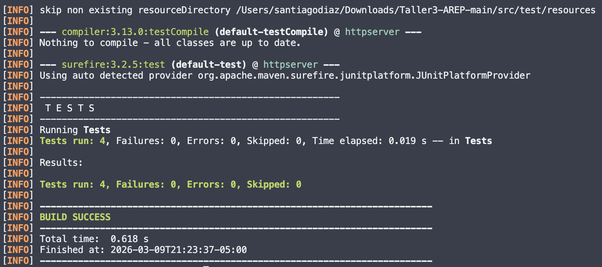

---

## Evidencia — Pruebas locales

### Versión 1 — carga desde línea de comandos

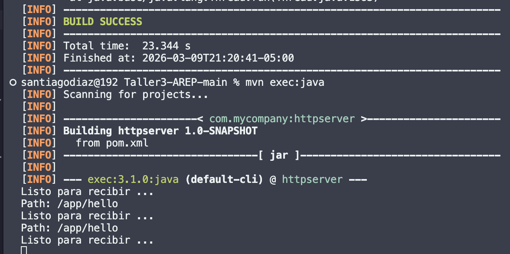

### Ruta `/app/hello`


### Ruta `/app/greeting?name=Santiago`


### Compilación exitosa (`mvn clean install`)

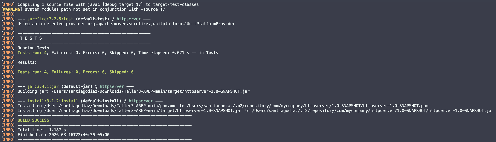

### Docker build

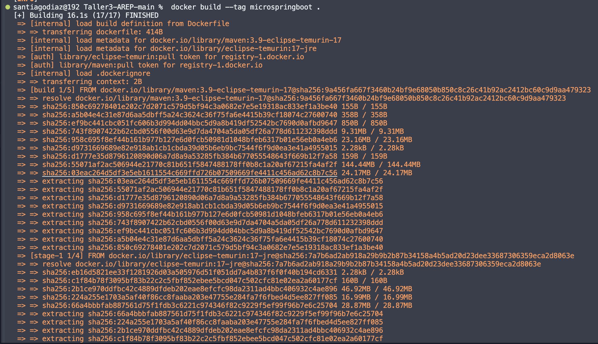

---

## Evidencia — DockerHub

### Imagen publicada en DockerHub

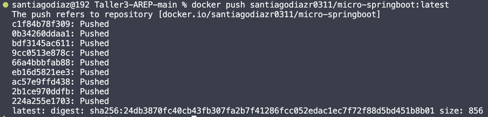
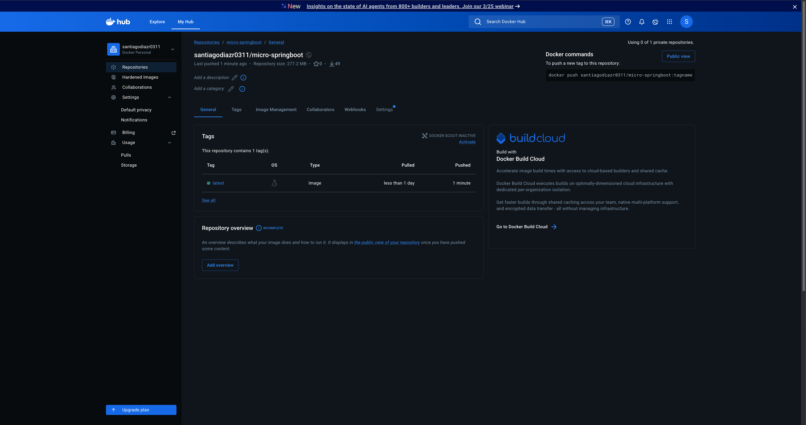
---

## Evidencia — AWS EC2

### Contenedor corriendo en EC2 (`docker ps`)

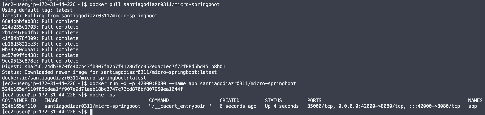

### Ruta `/app/greeting?name=AREP` desde EC2


### Ruta `/app/hello` desde EC2


### Apagado elegante (`docker stop` + `docker logs`)

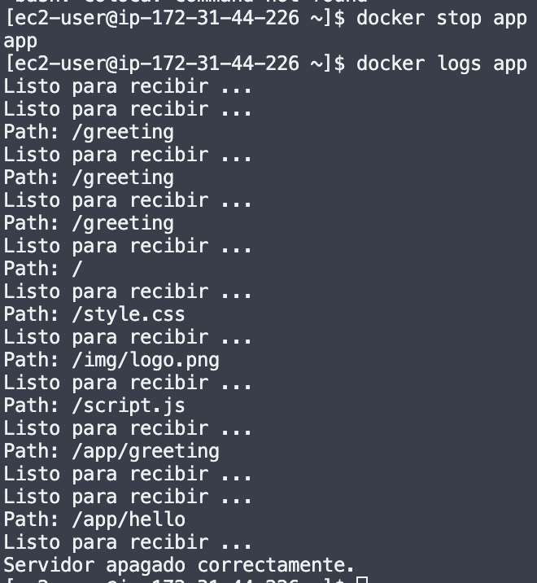

---

## Video de despliegue

https://drive.google.com/file/d/1KbJXBeNZv3uxiUik4vXMr8UTuc-TG3H3/view?usp=sharing

---

## Tecnologías

- Java 17
- Maven
- JUnit 5
- Docker

### Autor: Santiago Diaz Rojas
